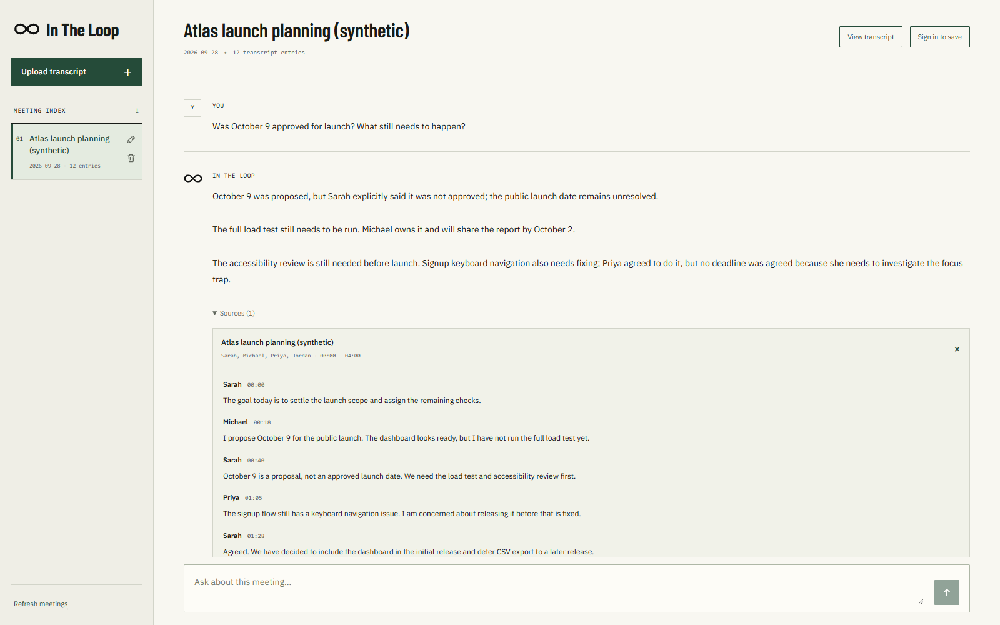
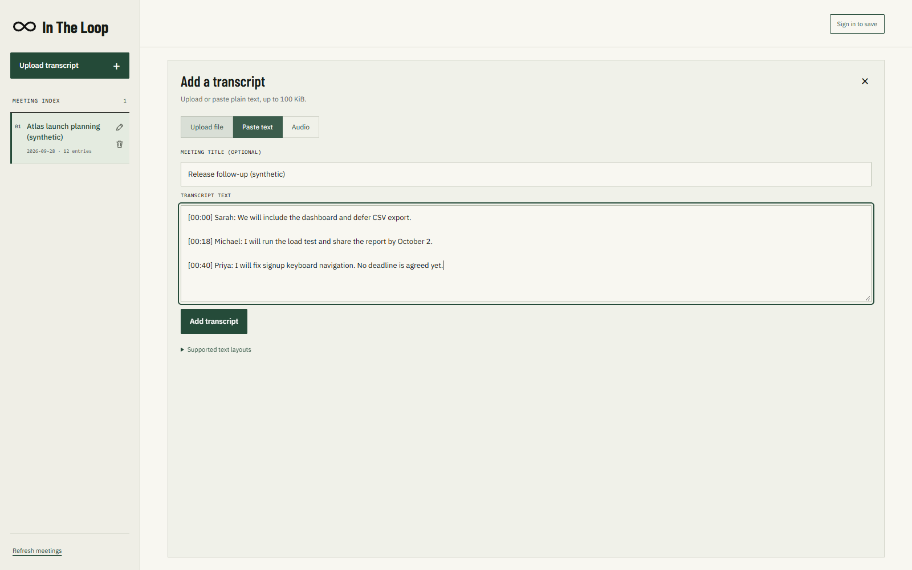
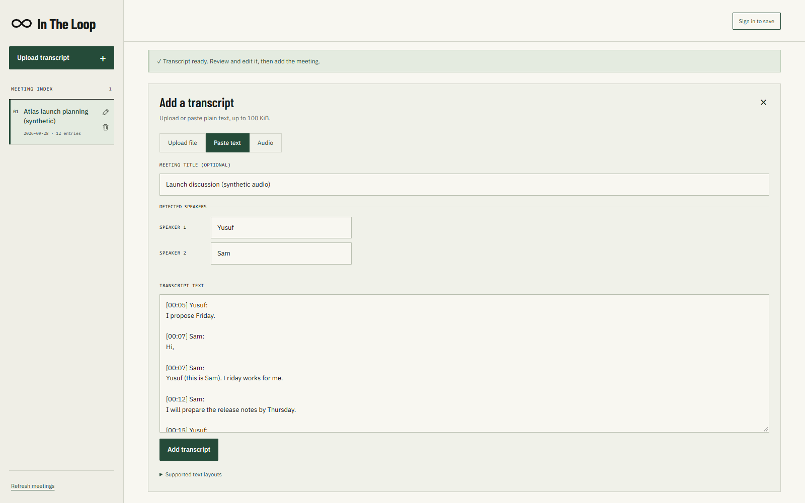

# In The Loop

In the Loop is a meeting intelligence application that turns meeting transcripts into searchable, conversational knowledge. In this program, users are able to upload or paste a transcript, select a meeting, and ask any questions about discussions, decisions, deadlines, and whatever other details from that meeting. There is also an option for voice-to-transcript, where the program also differentiates different speakers and allows the user to rename them.

## Screenshots

Desktop views using synthetic meeting data.

**Meeting Q&A with supporting evidence**



**Transcript creation (upload or paste)**



**Audio transcription and speaker renaming**



## Quick Setup Instructions

The easiest way to try In The Loop is through the live deployment:

**Live App:** https://in-the-loop-nu.vercel.app/

To run the project locally:

1. Clone the repository and install dependencies:

```bash
git clone https://github.com/yusufqazi/in-the-loop.git
cd in-the-loop
npm ci
```

2. Copy `.env.example` to `.env.local` and provide the following environment variables:

```text
OPENAI_API_KEY
SUPABASE_URL
SUPABASE_SERVICE_ROLE_KEY
NEXT_PUBLIC_SUPABASE_URL
NEXT_PUBLIC_SUPABASE_ANON_KEY
```

3. For a new Supabase project, run `supabase/schema.sql` in the Supabase SQL Editor and enable email/password authentication.

4. Start the application:

```bash
npm run dev
```

5. Open `http://127.0.0.1:3000`.

## Architecture Overview

In The Loop runs as a Next.js application. I kept the architecture in one application instead of separating the front end and back end into different services. The reason for this was so that it was simpler for the scope of this project.

- **Frontend:** Next.js, React, TypeScript, and Tailwind CSS
- **Backend:** Next.js API routes written in TypeScript
- **Database & Authentication:** Supabase with PostgreSQL and Supabase Auth
- **Vector Search:** pgvector
- **AI:** OpenAI for embeddings, meeting Q&A, and audio transcription
- **Deployment:** Vercel

### How it works

When a transcript is uploaded into the program, the server parses it while preserving speakers as well as timestamps. The transcript is then divided into smaller chunks, and then OpenAI generates an embedding for each chunk. The chunks and their embeddings are then stored in Supabase's database.

When a user asks a question, the question is also embedded and compared against the stored meeting chunks using pgvector. The most relevant sections of the meeting are retrieved and provided to the language model for context. The generated answer is then returned with the evidence (supporting pieces of the transcript)

Authentication for the app is handled by Supabase Auth, and stored meetings are associated with their respective users. 

Audio recordings also follow the same pipeline. OpenAI first converts the audio into a speaker separated transcript, which the user can review and edit before saving it as a meeting.

## Productionization and Scalability

In the Loop is currently deployed as a single Next.js application on Vercel with Supabase handling authentication, PostgreSQL, and vector storage. OpenAI takes care of embeddings, responses, and audio transcription.

The current architecture works well for the scope of this project, but I would make a few changes before using it at on a larger production scale.

- **Background processing:** Transcript ingestion, embedding generation, and audio transcription currently happen during API requests. At a bigger scale, I would move these into background jobs with retries so tasks that take longer to process don't block requests.
- **Large files:** The current application intentionally limits transcript and audio sizes. For longer meetings, I would upload audio to private object storage and process it asynchronously instead of keeping the entire upload in memory.
- **Rate limiting:** I would add per-user rate limits and usage quotas to control abuse, API costs, and concurrent AI requests. During development, I also encountered a signup rate limit in my program with my current Supabase configuration, which only allowed 2 users to sign up per hour. For a proper production level application, I would configure a dedicated SMTP provider and appropriate authentication rate limits so account creation would be able to support real and proper usage.
- **Database scaling:** I would add pagination and monitor vector-search performance as the amount of stored data grows. I would only introduce more advanced vector indexing if performance measurements showed it was necessary.
- **Security:** I would move toward more least-privilege database access, strengthen database-level authorization, rotate secrets, and add audit logging.
- **Monitoring:** The application already uses structured server logs, but a production system would centralize these logs and add monitoring for errors, latency, AI usage, costs, and failed background jobs.
- **Data retention:** I would define clear retention and deletion policies for user data and add tested backup and recovery procedures.

## RAG / LLM Approach and Decisions

I wanted the RAG pipeline to stay as simple as possible and understandable rather than adding extra frameworks or services that weren't necessary for this project. The application uses a custom TypeScript pipeline with OpenAI, Supabase, and pgvector directly.

### Models and Vector Storage

I chose GPT-6 Luna for meeting Q&A because it is lightweight, responds super quickly, and is very cost efficient. Meeting questions and summaries don't usually require a very heavy reasoning model so there was no reason to use something like Sol or Astra, and therefore, I felt that a faster model was a better fit for this use case.

For embeddings, I use OpenAI's text-embedding-3-small. The embeddings are stored in Supabase using pgvector. Since I was already using Supabase for PostgreSQL and authentication, I felt like keeping the vectors there as well allowed me to not have to add a separate vector database and keep the entire architecture simpler.

### Chunking and Retrieval

When a transcript is uploaded, it's parsed and divided into chunks while preserving the speaker's info and timestamps. I thought preserving speakers was important because meetings often involve people assigning each other tasks, responding to specific people, making decisions, etc. Losing speaker info would mean losing context.

Timestamps were preserved so the evidence could keep its position in the meeting and users can verify when something was said.

When a user asks a question, the question is embedded and compared with chunks from the selected meeting using cosine similarity. The system retrieves up to six relevant chunks, then proceeds to provide them to the language model to use for context.

I intentionally kept retrieval as simple as I could. There is currently no reranker, agent framework, or hybrid search system. My goal was to make sure the core RAG pipeline was reliable instead of adding complexity without knowing whether or not it was necessary.

### Prompting, Guardrails, and Evidence

The model is instructed to distinguish between things like proposals, confirmed decisions, assignments, deadlines, conflicts, and later corrections. Conversation history can help understand follow up questions, but its not treated as evidence about what happened in the meeting.

I also want users to be able to verify the AI rather than just blindly trust the answer, because everything including AI can make mistakes or give inaccurate answers in certain cases. Responses for this reason include supporting transcript sources so the user can see where the information came from.

The server validates citation IDs against the chunks that were actually retrieved. If there isn't enough evidence to answer a question, then the system will return a insufficient-evidence response instead of trying to force an answer.

### Quality and Observability

The project includes tests covering transcript parsing, chunking, metadata, model compatibility, citations, retrieval behavior, and the upload-to-answer flow. The application also uses structured server logs to track information such as request latency, retrieval counts, errors, and model usage without logging transcript contents or user questions. with more time I would evaluate retrieval quality across a larger set of meetings before deciding whether more advanced techniques like reranking or additional vector indexing are necessary or not.

## Key Technical Decisions

### Keeping the Architecture Simple

I chose to keep the frontend and backend together in one Next.js app. For the scope of this project, I wanted the architecture to be as simple as possible and didn't really see a need to introduce a separate backend service. I also chose Supabase for both the database and auth. I have experience using Supabase and find it very easy to use and work with, and it allowed one service to handle PostgreSQL, auth, and vector storage rather than me having to introduce separate services for each of these.

### Guest and Account access
I wanted the main application to be usable immediately without requiring someone to create an account. Logging in is a feature, not a requirement. Users can upload a meeting and try the core functionality as a guest, while signing in adds persistence so their meetings and chats can be saved.

This was especially useful for a demo app because someone evaluating the project can immediately try the application without having to go through account creation first.

### Speaker Review
Audio transcription uses speaker diarization, but the AI may not know the actual names of the people that are speaking. In a real meeting, participants most probably already know each other and maybe don't say their names out loud. Because of this, I allow the user to review the generated transcript and rename speakers before saving the meeting. This gives the user full control over speaker attribution before the transcript is used by the rest of the system.

### Synchronous Processing
For the current bounded scope: transcript ingestion, embeddings, and transcription are processed directly through API requests. I kept this approach because it avoided having to introduce queues and background workers for a pretty small application.

For larger files or production scale usage, I would move these operations to background jobs with retry and processing-status support.

## Engineering Standards

I focused on keeping the project reliable through testing, validation, type safety, secure data handling, and structured error handling.

### Testing and Code Quality

The project uses Vitest and has 215 passing tests across 12 test files. Tests cover important parts of the application including transcript parsing, chunking, citations, authentication and ownership, meeting management, audio validation, speaker diarization, model responses, and failure cases.

TypeScript strict mode is used in the app. I also use ESLint, TypeScript type checking, and production build verification as part of validating the project.

```bash
npm test
npm run lint
npm run typecheck
npm run build
```

### Validation and Error Handling

Inputs are validated before being processed or sent to external services. This includes transcript and audio file types and sizes, request sizes, questions, meeting IDs, speaker names, embeddings, and structured AI responses.

API, database, and AI provider errors are converted into safe application errors rather than exposing raw internal errors to the user. Requests also receive an ID that can be used to connect an error shown to the user with the corresponding server log.

### Security and Data Isolation

API requests verify the signed-in user or guest session before accessing meeting data. Database operations and retrieval are scoped to that account or session so one user cannot access another user's meetings.

Sensitive credentials such as the OpenAI and Supabase service-role keys remain server-side and are not exposed to the browser.

### Logging

The application uses structured server logs for information such as request latency, status, errors, retrieval timing, chunk counts, and model usage.

Private content such as transcript text, user questions, audio content, API keys, and raw provider responses is intentionally excluded from logs.


## AI Assisted Development

I used Codex as my primary coding assistant throughout the development of In the Loop. I used it to help create the initial project structure, implement features, debug larger issues, write tests, and inspect the application for problems.

My general workflow was to define what I wanted a feature to do and give Codex detailed instructions before having it implement the change. I also used other AI tools such as Gemini to help me think through ideas and turn my requirements into more detailed implementation prompts for Codex. 

I did not treat generated code as immediately and automatically correct. I reviewed a significant portion of the code, especially major files that were created or changed for things like new features. If I found any incorrect behavior or implementation issues, I would investigate them myself or have Codex help identify the cause, make a correction, and verify the result again. 

This process caught several issues during development. Some of them being problems with transcript parsing, database SQL, auth callbacks, and request validation. Automated tests, linting, type checking, and live API/database testing were also used to verify changes.

I maintained a DEVELOPMENT_NOTES.md file throughout the project as a shared development record between myself and Codex. It tracked worked that had been completed, implementation decisions, testing, issues that were found, and remaining limitations. I used these notes to keep track of the project as it evolved rather than relying only on the current generated code.

I also controlled AI-assisted overengineering. The goal was not to add as many features or technologies as possible but to build a relatively simple application that performs its main purpose well. I regularly prioritized the core meeting-intelligence workflow over additional frameworks, services, or features that were not necessary for this assessment.